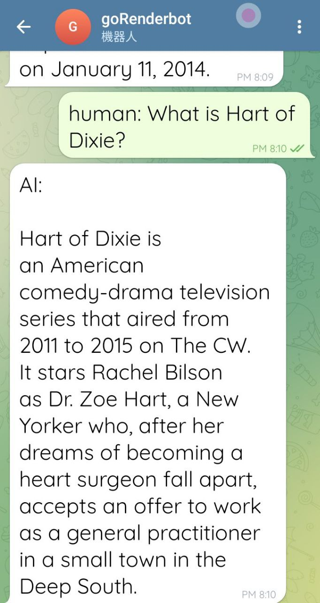

# Golang-ChatGPT-TelegramBot-Render
# A Golang ChatGPT TelegramBot project, quickly built on the platform Render

### [繁體中文](https://github.com/pyfbsdk59/Golang-ChatGPT-TelegramBot-Render/blob/main/README_tw.md) 
### [日本語](https://github.com/pyfbsdk59/Golang-ChatGPT-TelegramBot-Render/blob/main/README_jp.md)

#### Demo

  
  

#### 1. This project refers to the following ones and official docs below.
https://github.com/kkdai/chatgpt 
https://github.com/yanzay/tbot 
https://github.com/sashabaranov/go-gpt3

#### 2. Please fork this project to your own Github account first. Go to Render website, choose to add "Web Services", import this project with your Github account, and then set your own project name and choose a free plan. Remember to click "Advanced" below to set the environment variables.

#### 3. Four environment variables must be set in Render's Environment Variables in this project, namely OPENAI_TOKEN and OPENAI_MAXTOKENS, which are OPENAI's api key and the upper limit of the token number of the answer text (the more you set, the more text of the answer you get, but if you exceed the free quota, you will spend more money. It can be set around 200-400 at the beginning), and then there is another environment variable TELEGRAM_BOT_TOKEN of Telegram. It may take some time to start deploying after setting. 

#### 4. Open the browser, enter the following URL, set the webhook as the last step of deploying on Render, the format is: https://api.telegram.org/bot{$token}/setWebhook?url={$webhook_url }.

##### The actual example is like the following example (Don't copy and paste it directly, and please use your own telegram token and the URL of the Render project):

https://api.telegram.org/bot606248605:AAGv_TOJdNNMc_v3toHK_X6M-dev_1tG-JA/setWebhook?url=https://xxx.onrender.com/

#### 5. After success, the following text will be displayed on the browser:

{
   ok: true,
   result: true,
   description: "Webhook was set"
}
------
#### telegram and OPENAI api settings: 
https://github.com/howarder3/GPT-Linebot-python-flask-on-vercel 
https://ithelp.ithome.com.tw/articles/10245264 
https://tcsky.cc/tips-01-telegram-chatbot/

